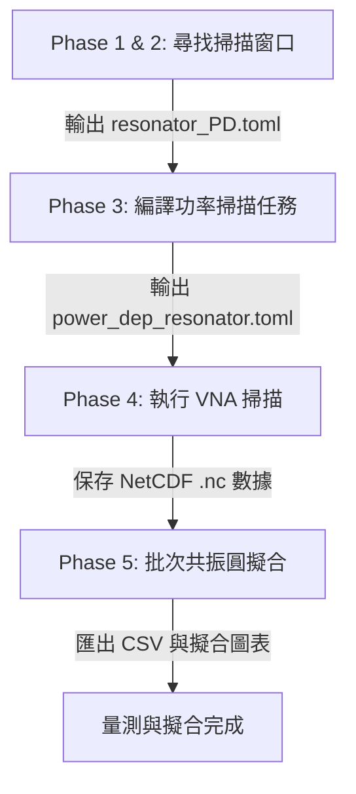

# VNA 共振腔量測協調器 (vna_orchestrator.py) 說明文檔

`vna_orchestrator.py` 是一個用於自動化向量網路分析儀 (VNA) 共振腔量測與批次數據擬合的統一協調器。它將共振腔的尋找、窗口定位、功率掃描與物理擬合串聯成一個高度自動化的管線 (Pipeline)。

---

## 系統架構與核心管線

量測工作流共分為 **5 個主要階段 (Phases)**：



### 模組化拆分與代碼結構 (Modular Architecture & SRP Split)

為了遵循**單一職責原則 (Single Responsibility Principle, SRP)**，本專案已將原本龐大的上帝類別 `VNAOrchestrator` 解耦拆分為多個職責專一的子模組，並放置在 `orchestrator/` 套件目錄下：

| 檔案路徑 | 核心類別/模組 | 主要職責 |
| :--- | :--- | :--- |
| [`orchestrator/config_manager.py`](file:///Users/Shared/中研院/LiteMWSInstr/orchestrator/config_manager.py) | `ConfigManager` | 負責讀寫 TOML 檔（`vna.config` 等），並執行 **Overlap Guard** 防止掃描窗口重疊。 |
| [`orchestrator/instrument_driver.py`](file:///Users/Shared/中研院/LiteMWSInstr/orchestrator/instrument_driver.py) | `InstrumentDriver` | 封裝 VNA 連線、生命週期管理與單次掃描，支援 DUMMY 離線物理模擬。 |
| [`orchestrator/resonance_analyzer.py`](file:///Users/Shared/中研院/LiteMWSInstr/orchestrator/resonance_analyzer.py) | `ResonanceAnalyzer` | **純演算法模組**，負責 Dip 搜尋、信心度評分與細掃描 Trial Circle Fit 驗證，不含 I/O。 |
| [`orchestrator/report_generator.py`](file:///Users/Shared/中研院/LiteMWSInstr/orchestrator/report_generator.py) | `ReportGenerator` | 負責輸出，包含 NetCDF (.nc) 數據存檔、CSV 審計報告（Audit Trail）寫入與光譜繪圖。 |
| [`orchestrator/task_compiler.py`](file:///Users/Shared/中研院/LiteMWSInstr/orchestrator/task_compiler.py) | `TaskCompiler` | 編譯 Phase 3 具有 SNR 自適應 Repeat Count 的 `power_dep_resonator.toml` 任務清單。 |
| [`orchestrator/batch_fitter.py`](file:///Users/Shared/中研院/LiteMWSInstr/orchestrator/batch_fitter.py) | `BatchFitter` | 執行 Phase 5 的批次 Q 因子圓擬合（支援 Notch 與 Reflection），匯出全球擬合 CSV 與 IQ 圓圖。 |
| [`vna_orchestrator.py`](file:///Users/Shared/中研院/LiteMWSInstr/vna_orchestrator.py) | `VNAOrchestrator` | 主入口點與協作膠水層，負責協調上述六個子系統來完成完整的量測管線。 |

---

### Phase 1 & 2: 最佳化頻率掃描窗口尋找 (Window Finding / Blind Search)

此階段的目標是找出每個共振腔的準確中心頻率與合適的掃描頻寬。

* **盲搜尋 (Blind Search)**：若未事先指定共振腔頻率，程式會在指定的頻帶（如 4~8 GHz）執行多通道 (Multi-pass) 粗掃描，利用 `find_peaks` 提取候選 dip，並進行粗 deduplication。接著對每個候選腔進行 narrow verification scan (細掃描)，精準算出其半高寬 (FWHM)。
* **重疊保護機制 (Overlap Guard)**：為防範相鄰共振腔在寬掃描時相互拉扯與干擾，系統會自動計算相鄰共振腔設計頻率的距離，並將其 start 與 stop 窗口對稱地限制在距離的 1/2 處。
* **掃描重試機制 (Retry Loop)**：若粗掃描沒有找到 dip，程式會自動嘗試降低中頻頻寬 (IF Bandwidth) 以增強 SNR，或提高點數、擴大範圍，直到成功定位。

### Phase 3: 編譯功率相關任務清單 (Compile Tasks)

依據 `resonator_PD.toml` 中的共振腔列表，計算在各個功率下的量測重複次數。

* **SNR 自適應重複次數**：
  $$Repeat = 10^{\frac{\text{power\_ave\_ratio} - (P_{\text{VNA}} - \text{attenuation})}{10}}$$
  在低功率下雜訊大，系統會自動增加重複測量次數 (Repeat Count) 以便後續進行 Average 降噪；在高功率下則減少測量次數，節省時間。
* 輸出為 `power_dep_resonator.toml` 任務清單。

### Phase 4: 執行功率掃描 (Run Sweep)

* 連接 VNA (支援 ZNB 與 E5080B，以及離線 DUMMY 模式)。
* 遍歷 Phase 3 產生的任務清單，在每個共振腔的專屬窗口與重複次數下執行 sweep。
* 將複數 S21/S11 數據儲存為符合 `xarray` 規範的 NetCDF (.nc) 格式，保留完整的量測時間、中頻頻寬、功率和衰減量等 metadata。

### Phase 5: 批次共振圓擬合 (Batch Fitting)

* 批次載入 Phase 4 的 .nc 數據，並排除系統資料夾（`nc/` 與 `plots/`）。
* **重複量測複數平均**：自動將同一個共振腔下、相同功率資料夾內的所有重複量測數據進行複數平均（Complex Averaging），以最大化訊噪比。
* **自動端口判斷與擬合**：
  * 反射通道（S11, S22, S33, S44）使用 `circuit.reflection_port` 進行平均數據擬合。
  * 穿透通道（S21 等）使用 `circuit.notch_port` 進行平均數據圓擬合。
* 呼叫 `autofit()` 執行擬合，並在各功率子資料夾下產出單一一套平均擬合圖表：
  * `fit_IQ.png`：複數平面平面圓擬合。
  * `fit_amplitude.png`：振幅擬合。
  * `fit_phase.png`：相位擬合。
* **產生二維熱力圖**：當有多個功率數據時，自動產生功率相依響應圖 `{resonator}_power_heatmap.png`。
* 匯出各共振腔的擬合 CSV 檔案與綜合統計全域總表 `global_fit_summary.csv`。

---

## 設定檔說明

系統依賴三個核心 TOML 設定檔進行流程控制：

### 1. `vna.config` (全域控制設定)

定義硬體連線、盲搜尋參數及預設量測設定：

```toml
[hardware]
  model = "ZNB"                           # 儀器型號: "ZNB", "E5080B" 或 "DUMMY"
  address = "TCPIP0::192.168.1.123::inst0::INSTR"
  attenuation = 80                        # 傳輸線總低溫衰減量 (dB)
  port = "S43"                            # 量測端口

[blind_search]
  start_freq_ghz = 4.0                    # 盲搜尋起始頻率
  stop_freq_ghz = 8.0                     # 盲搜尋截止頻率

[verification]
  # 驗證掃描的參數配置
  points = 501                # 驗證掃描點數
  if_bandwidth_hz = 200       # 驗證掃描中頻頻寬 (Hz)
  min_span_mhz = 0.2           # 驗證細掃跨距下限 (MHz)
  high_q_trigger_ratio = 2.5   # High-Q 動態重掃觸發臨界比例
  min_resweep_span_mhz = 0.05  # High-Q 重掃最小跨距 (MHz)

[filtering]
  scoring_method = "geometric"         # 選擇評分計算方式: "geometric" (幾何平均) 或 "arithmetic" (算術平均)
  min_arithmetic_score = 50.0          # 算術平均分數硬門檻，如50.0/100
  min_geometric_score = 30.0           # 幾何平均分數硬門檻，如30.0/100
  max_chisq_fit = 0.05                 # 物理圓擬合殘差硬門檻
  min_fwhm_khz = 5.0                   # 細掃驗證 FWHM 硬性下限 (kHz)
  max_fwhm_mhz = 15.0                  # 細掃驗證 FWHM 硬性上限 (MHz)
  weight_fwhm = 0.4                    # 頻寬分數權重
  weight_depth = 0.3                   # 波谷深度分數權重
  weight_iq = 0.3                      # 圓擬合品質分數權重

[fwhm]
  min_khz = 50.0                          # 最小估計 FWHM (防止 noisy spike 誤判)
  window_multiplier = 15.0                # 最終窗口為估算 FWHM 的倍數
  target_fwhm_khz = 300.0                 # 評分滿分中心寬度 (kHz)
  fwhm_sigma_decade = 0.5                 # 評分容忍度對數標準差 (Decades)

[execution]
  action = "run-all"                      # 預設執行的量測動作 (定義如下)
  dummy = false                           # 是否使用離線模擬模式 (Offline Dummy)
```

#### **`execution.action` 參數說明**

| `action` 設定值 | 對應 CLI 參數 | 分步執行之核心功能 |
| :--- | :---: | :--- |
| **`run-all`** | `--run-all` | **全自動完整管線**：循序執行盲搜尋、任務編譯、功率掃描與數據擬合（Phase 1 至 5）。 |
| **`blind-search`** | `--blind-search` | **盲搜尋窗口定位**：僅在 `[start_freq_ghz, stop_freq_ghz]` 範圍內搜尋 dip 候選者並定位其掃描窗口（Phase 1 & 2）。 |
| **`find-windows`**| `--find-windows` | **手動窗口定位**：不執行盲搜尋，直接依據手動設定的設計中心頻率進行窗口探測與最佳化，更新 `resonator_PD.toml`（Phase 1 & 2 Fallback）。 |
| **`compile`** | `--compile-tasks`| **任務清單編譯**：讀取 `resonator_PD.toml` 內的窗口，自適應編譯功率掃描任務清單 `power_dep_resonator.toml`（Phase 3）。 |
| **`sweep`** | `--run-sweep` | **功率掃描執行**：連接 VNA 並依據任務清單執行物理掃描，匯出複數 S 參數至 NetCDF (.nc) 格式（Phase 4）。 |
| **`fit`** | `--fit` | **批次圓擬合**：僅讀取歷史量測的 .nc 檔案執行 Circle Fitting 物理擬合並輸出 CSV 報告（Phase 5）。 |

---

### 2. `resonator_PD.toml` (共振腔專屬窗口設定)

由 Phase 1 & 2 自動產生/更新，包含每個共振腔的專屬 FWHM 掃描區間：

```toml
[[resonator]]
  label = "C60000"
  IF_bandwidth = 20
  [resonator.power]
    min = -50.0
    max = 0.0
    step = 5.0
  [resonator.frequency]
    start = 5992500000.0                  # 最佳化後的掃描起點
    stop = 6007500000.0                   # 最佳化後的掃描終點
    points = 501
```

### 3. `power_dep_resonator.toml` (功率任務清單)

由 Phase 3 自動編譯產生，包含詳細的展開量測清單、輸出資料夾與重複次數。

---

## 常用 CLI 命令

所有流程均可透過 CLI 參數靈活控制：

* **執行完整流程 (Phase 1 到 5)**：

  ```bash
  python3 vna_orchestrator.py --run-all
  ```

* **強制離線 Dummy 測試（全管線，在 4~8 GHz 動態產生 5 個 Lorentzian 腔體進行功能驗證）**：

  ```bash
  python3 vna_orchestrator.py --dummy --run-all --start-freq 4.0 --stop-freq 8.0
  ```

* **僅執行盲搜尋並定位窗口 (Phase 1 & 2)**：

  ```bash
  python3 vna_orchestrator.py --blind-search --start-freq 5.0 --stop-freq 7.0
  ```

* **僅執行批次圓擬合 (Phase 5)**：

  ```bash
  python3 vna_orchestrator.py --fit
  ```

---

## 尋腔與驗證頻率核心機制之數學條件與設定細節 (Core Search & Verification Mechanisms)

本系統的核心頻率探測機制包含**盲搜尋模式 (Blind Search)** 與**手動窗口定位模式 (Window Finding)**。以下是所有觸發條件、VNA 設定、數學閾值與去重邏輯的詳細說明：

### 1. 盲搜尋與驗證機制 (Blind Search)

此機制在 `--blind-search` 或 `--run-all` 時啟動。分為 **Step A 粗搜尋**、**Step B 細驗證**、**去重與後過濾** 三個階段：

#### 【階段 A】粗掃描與候選頻率搜尋 (Coarse Sweep & Peak Detection)

1. **掃描設定 (VNA Config Passes)**：
   依序執行三個 Pass 的全頻寬掃描。若 `vna.config` 未指定則套用預設值：
   * **Pass 1 (高功率)**：功率 = `-15.0` dBm，中頻頻寬 = `1000` Hz，掃描點數 = `16001` 點。
   * **Pass 2 (低功率)**：功率 = `-35.0` dBm，中頻頻寬 = `200` Hz，掃描點數 = `16001` 點。
   * **Pass 3 (極低功率)**：功率 = `-45.0` dBm，中頻頻寬 = `100` Hz，掃描點數 = `16001` 點。

2. **Dip 搜尋與動態 Prominence 閥值**：
   * 轉為分貝（dB）後使用 `find_peaks(-magnitude, prominence=current_prom)` 進行谷值偵測。
   * 初始 Prominence 閥值：若有指定 `--expected-dips`，則設為 `max(2.5, CLI_prominence)`；若無，則直接採用 `CLI_prominence`（預設 `2.0` dB，或從設定檔 `blind_search.prominence_db` 載入）。
   * **背景噪訊自適應底限 (Prominence Floor)**：
     * 估算噪訊標準差：$\sigma_{\text{noise}}$（使用 Median Absolute Deviation 估計）。
     * 尋峰門檻下限 $\text{min\_prominence}$ 的決定：
       * 若 `blind_search.min_prominence_db` 設定為 `"auto"`，則其值為 $\text{min\_ns\_mult} \times \sigma_{\text{noise}}$，其中 $\text{min\_ns\_mult}$ 來自 `fwhm.min_noise_sigma_multiplier`（預設 `3.0`）。
       * 若 `blind_search.min_prominence_db` 為浮點數（例如 `0.3`），則直接將此數值做為硬性下限門檻。
     * 標準門檻 $\text{auto\_prom} = \max(\text{min\_prominence}, \text{ns\_mult} \times \sigma_{\text{noise}})$。
     * 搜尋底限門檻 $\text{Floor} = \max(\text{min\_prominence}, \text{min\_ns\_mult} \times \sigma_{\text{noise}})$。
     * 若尋找到的 dip 數量小於預期數量，程式會以 $\Delta \text{prominence} = 0.25$ dB 為步進**遞減閥值**進行重新搜尋，直到達到 $\text{Floor}$ 為止。

3. **粗掃 FWHM 邊界過濾 (Hard Cuts)**：
   * 計算 half-height 寬度作為粗掃 FWHM。
   * **過濾條件**：
     * FWHM < `fwhm.min_khz`（預設 `5.0` kHz） ──> **丟棄**，記錄 `"FWHM too narrow"`。
     * FWHM > `fwhm.max_mhz`（預設 `15.0` MHz） ──> **丟棄**，記錄 `"FWHM too wide"`。

4. **粗去重 (Coarse Deduplication)**：
   * 對於在各個 Pass 搜尋到的每個候選 dip：
     * 計算去重間距門檻：$\text{spacing} = \max(\text{coarse\_spacing}, 0.5 \times \text{FWHM}_{1}, 0.5 \times \text{FWHM}_{2})$，其中 $\text{coarse\_spacing}$ 來自 `deduplication.coarse_spacing_mhz`（預設 `0.25` MHz）。
     * 若兩個候選 dip 的頻率差小於 $\text{spacing}$，判定為重複。
     * **去重勝出條件**：比較兩者的「初始評分」，高分者取代低分者，低分者丟棄並標記為 `"Coarse Duplicate"`。
       * 初始評分算法：$\text{Score}_{\text{coarse}} = 0.6 \times S_{\text{FWHM}} + 0.4 \times S_{\text{Depth}}$
       * $S_{\text{FWHM}} = 100 \times \exp\left(-\frac{(\log_{10}(\text{FWHM}) - \log_{10}(\text{target\_fwhm}))^2}{2 \times \sigma_{\text{dec}}^2}\right)$，其中 $\text{target\_fwhm}$ 預設 `300.0` kHz，$\sigma_{\text{dec}}$ 預設 `0.5` 階。
       * $S_{\text{Depth}} = \min(100.0, \max(0.0, \frac{\text{depth\_db} - 0.5}{9.5} \times 100))$

#### 【階段 B】自適應細掃描與物理圓擬合驗證 (Verification Scan & Circle Fit)

對於通過階段 A 的每個候選頻率 $f_c$：

1. **細掃描設定**：
   * **掃描範圍**：以 $f_c$ 為中心，自適應決定：$\text{span} = \max(\text{min\_span\_mhz} \times 10^6, 15.0 \times \text{FWHM}_c)$，其中最小跨距下限由 `verification.min_span_mhz`（預設 `0.2` MHz）定義。
   * **掃描點數**：`verification.points`（預設 `501`）。
   * **中頻頻寬**：`verification.if_bandwidth_hz`（預設 `200` Hz）。
   * **掃描功率**：若 `verification.power` 有設定則套用；若無，則套用該候選頻率被偵測到時的粗掃描 Pass 功率。

2. **二次 Dip 驗證與極高 Q 值動態重掃 (Option B Dynamic Resweep)**：
   * 在細掃描光譜中進行 `find_peaks`（以單峰模式 `expected_count=1` 進行）。
   * 若**完全找不到 dip** ──> **丟棄**，標記為 `"Verification Failure"`。
   * **動態高解析度重掃 (Dynamic High-Q Resweep)**：若驗證出來的實際 FWHM 極窄（$\text{span} > \text{high\_q\_trigger\_ratio} \times 15 \times \text{FWHM}$，倍數由 `verification.high_q_trigger_ratio` 預設為 `2.5`），系統會自動啟動第二階段動態重掃，將頻寬聚焦至 $15 \times \text{FWHM}$（最小下限由 `verification.min_resweep_span_mhz` 預設為 `0.05` MHz），以確保點陣密度（$>30$ 點）精確還原極高 Q 值共振腔。

3. **硬性門檻檢查 (Hard Threshold Filtering)**：
   * **FWHM 硬性上下限**：若 $fwhm < \text{min\_fwhm\_khz}$ 或 $fwhm > \text{max\_fwhm\_mhz}$ ──> **丟棄**，標記為 `"Verification Filtered"`。
   * **擬合殘差硬性上限**：若圓擬合殘差 $\chi^2 > \text{max\_chisq\_fit}$（如 `0.05`） ──> **丟棄**，標記為 `"Fit Failure"`。

4. **物理圓擬合驗證與信心度評分 (Circle Fitting Validation & Scoring)**：
   * **端口判斷**：S 參數 port 名稱若為 `S11`, `S22`, `S33`, `S44` ──> 套用 `circuit.reflection_port`。若為穿透通道如 `S21` ──> 套用 `circuit.notch_port`。
   * **擬合執行與排除**：執行 `port.autofit()`。若擬合拋出例外，或 $Q_i < 0$ / `NaN` ──> **丟棄**，標記為 `"Fit Failure"`。
   * **評分維度**：
     * $S_{\text{FWHM}} = 100 \times \exp\left(-\frac{(\log_{10}(\text{FWHM}_{\text{eval}}) - \log_{10}(\text{target\_fwhm}))^2}{2 \times \sigma_{\text{dec}}^2}\right)$，其中 $\text{FWHM}_{\text{eval}} = \sqrt{\text{FWHM}_{\text{spec}} \times \text{FWHM}_{\text{fit}}}$ （取光譜估算寬度與物理圓擬合寬度之幾何平均，以兼具強健性與客觀性）。
     * $S_{\text{Depth}} = \min(100.0, \max(0.0, \frac{\text{depth\_db} - 0.5}{9.5} \times 100))$
     * $S_{IQ} = \max(0.0, 100.0 \times (1.0 - \chi^2 / \text{max\_chisq\_fit}))$，圓擬合品質的分數歸一化上限來自 `filtering.max_chisq_fit`（預設為 `0.05`）
   * **計算方式選擇 (`scoring_method`)**：
      * **算術平均 (`arithmetic`)**：$\text{Score}_{\text{arithmetic}} = w_{\text{FWHM}} \times S_{\text{FWHM}} + w_{\text{Depth}} \times S_{\text{Depth}} + w_{IQ} \times S_{IQ}$
      * **幾何平均 (`geometric`)**：（預設）$\text{Score}_{\text{geometric}} = S_{\text{FWHM}}^{w_{\text{FWHM}}} \times S_{\text{Depth}}^{w_{\text{Depth}}} \times S_{IQ}^{w_{IQ}}$
      * （權重參數 $w$ 分別對應 `filtering` 中的 `weight_fwhm`、`weight_depth` 和 `weight_iq`，預設比例為 `0.4`、`0.3` 和 `0.3`）
   * **硬分數門檻過濾**：依據選定的 `scoring_method` 比較 `min_geometric_score` 或 `min_arithmetic_score`，若未達標 ──> **丟棄**，標記為 `"Score Filtered"`。

#### 【階段 C】精細去重與預期數量過濾 (Precise Deduplication & Filter-Last)

1. **精細去重**：
   * 經過擬合後取得高精準度的中心頻率，對所有通過驗證的腔體進行二次去重。
   * 去重間距門檻：$\text{spacing} = \max(\text{precise\_spacing}, 0.5 \times \text{FWHM}_1, 0.5 \times \text{FWHM}_2)$，其中 $\text{precise\_spacing}$ 來自 `deduplication.precise_spacing_mhz`（預設 `0.15` MHz）。
   * 若兩個腔體距離小於 $\text{spacing}$，**僅保留得分較高者**，另一者丟棄並標記為 `"Precise Duplicate"`。

2. **預期數量過濾 (Post-Filtering)**：
   * 若指定了 `--expected-dips N`，則將所有通過上述步驟的腔體依得分由高到低排序，**只保留前 N 個腔體**。其餘落選者標記為 `"Post-Filtering"` 並丟棄。

---

### 3. 輸出檔案結構與圖表可視化分類 (Output Structure & Visualizations)

每次執行盲搜尋後，系統會在 `data/<SampleName>_<Timestamp>/` 建立結構化目錄：

1. **外層審計報告 (Audit Trail)**：
   * `blind_search_report.csv`：完整的候選點歷程 CSV，記錄全候選點的頻率、功率、FWHM、$Q_i$、殘差 $\chi^2$、幾何/算術分數、最終狀態（`Passed` 或 `Discarded`）與詳細判定理由。
   * `blind_search_report.md`：排版精美的 Markdown 審計總表。
2. **`nc/` 子目錄 (NetCDF Raw Data)**：
   * 集中存放粗掃描 (`coarse_sweep_passX_...nc`) 與細驗證掃描 (`verification_sweep_X_...nc`) 的複數 S 參數數據檔案。
3. **`plots/` 子目錄 (Visualization Graphics)**：
   * 包含全域標記總覽圖 `blind_search_coarse.png`。
   * **無標記線的綜合粗掃圖 `blind_search_coarse_raw.png`**。
   * **各個粗掃 Pass 的單獨圖表 `blind_search_coarse_pass{idx}.png`**。
   * 包含通過腔體組合圖 `blind_search_fine_all.png`。
   * **`plots/passed/`**：存放所有通過驗證共振腔（`Status: Passed`）的細掃描曲線圖（疊加紅色擬合模擬曲線 `fit` 與綠色 FWHM 輔助線）與 IQ 複數平面圓圖。
   * **`plots/discarded/`**：存放所有成功完成物理擬合但因分數/殘差門檻被淘汰者（`Status: Discarded`）的細掃描曲線圖與 IQ 圓圖，方便使用者進行診斷與調校。

---

### 2. 手動窗口定位機制 (Window Finding)

此機制在 `--find-windows` 且沒有啟用盲搜尋時啟動。它適用於**已知共振腔預期設計頻率**的情境。它直接對 `measurement_window_finding.toml` 中列出的各個諧振腔進行目標定位：

#### 【階段 A】目標粗掃描與重試機制 (Coarse Sweep & Retries)

1. **掃描設定**：
   * 掃描區間：$[f_{\text{design}} - \Delta f, f_{\text{design}} + \Delta f]$，其中 $\Delta f$ 為 `deltafre`（設定檔中指定）。
   * 點數、功率、中頻頻寬皆來自工作清單對應任務。

2. **重試機制 (Retry Loop)**：
   * 進行單峰 dip 搜尋。若**沒有找到任何 dip**，則啟動最多 3 次重試：
     * **重試 1 (提升解析度與 SNR)**：點數調整為 `retry_1_points`（預設 `1601`），中頻頻寬降低至 `retry_1_ibw_hz`（預設 `200` Hz）。
     * **重試 2 (擴大搜尋頻帶)**：掃描區間半寬 $\Delta f$ 乘以 `retry_2_range_multiplier`（預設 `2.0` 倍）。
     * **重試 3 (功率調諧防飽和)**：VNA 輸出功率增加 `retry_3_power_boost_db`（預設 `5.0` dB）。
   * **降級退避 (Degradation)**：若 3 次重試後仍找不到 dip，則放棄探測，直接以設計頻率 $f_{\text{design}}$ 為中心，套用預設的 `fallback_window_mhz`（預設 `2.0` MHz）作為該共振腔的量測窗口。

3. **FWHM 硬性約束 (Clipping)**：
   * 若成功找到 dip，計算 FWHM。
   * 與盲搜尋不同，手動模式採用截斷處理：
     * FWHM < `fwhm.min_khz`（手動模式預設 `50.0` kHz） ──> 設為最小值。
     * FWHM > `fwhm.max_mhz`（手動模式預設 `1.0` MHz） ──> 設為最大值。
   * ** Step B 視窗預估**：$[f_{\text{peak}} - 15 \times \text{FWHM}, f_{\text{peak}} + 15 \times \text{FWHM}]$。

#### 【階段 B】精確細掃描 (Fine Sweep)

1. **掃描設定**：
   * 掃描範圍為 Step A 預估的優化區間。
   * 點數、功率與中頻頻寬回復為原始設定。

2. **二次 Dip 定位與擬合確認**：
   * 執行細掃描並定位最終共振頻率 $f_{\text{refined}}$ 與細掃 $\text{FWHM}_{\text{fine}}$。
   * 執行 Step B Trial Circle Fit，若擬合非物理數值則丟出警告，但不會直接丟棄（保留量測機會）。
   * 最終掃描窗口限制在：
     $$\text{Start} = f_{\text{refined}} - 15 \times \text{FWHM}_{\text{fine}}$$
     $$\text{Stop} = f_{\text{refined}} + 15 \times \text{FWHM}_{\text{fine}}$$
